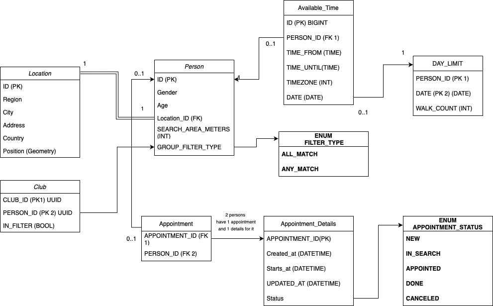

# matcher-service
Подбор пользователей для прогулки исходя из предпочтений, наличия пользователя в группе. Хранение и менеджмент пользовательских «анкет», в которых описаны их предпочтения (через группы)

---
### Функциональные требования:

- поиск наиболее подходящих для прогулки пользователей среди ближайших
    - Фильтрация подходящих пользователей по группам
    - Быстрый поиск без фильтров
- Хранит все данные о пользовательских характеристиках(пол, возраст, координаты, список групп), на основе которых предлагает кандидатов
- Сервис должен гарантировать пользователю поиск кандидата, даже если уже найденый кандидат откажется от прогулки
- Должен быть всегда способен найти партнера для прогулки (даже если он находится на большом расстоянии, если пользователь это расстояние не ограничил)
- Хранит историю прогулок
- Отправка запроса на прогулку пользователю, с которым уже была прогулка

---
### Доменная модель



---
### Алгоритм подбора
_П1_ - текущий пользователь, управляющий приложением

_П2_ - подобранный для П1 пользователь

_WALK_TIME_ = время которое отводится на прогулку, пока = 1 час

Счетчик встреч задается пользователем перед началом подбора, счетчик задается для каждого дня, он не может быть больше (заданного интервала доступа определенного дня / WALK_TIME) 
Вид фильтра по группам:
- если вид=ALL_MATCH, то все группы из фильтра П1 должны быть = всем группам из фильтров встречи, ранее созданной П2
- если вид=ANY_MATCH, то хотя бы одна группа из фильтра П1 должна быть в фильтре групп из встречи, ранее созданной П2

П1 задает свои окна доступа, кол-во прогулок для каждого дня из окон доступа (если не передано, то берем = 2, если максимум позволяет), вид фильтров по группам, сами группы для фильтра и радиус поиска П2. Нажимает кнопку поиска.

0. Для П1 проверяем, что переданные окна доступа не пересекаются с текущими встречами, если пересечение есть, то отправляем ошибку. Также провреяем что окна доступа валидны (from < to)


0.1. Сохраняем переданную информацию о часах доступа в БД. (информация о фильтрах по группам, радиусе поиска и локации уже занесена в бд, поэтому тут мы ее не передаем), возвращаем в ответе все окна доступа П1, запускаем в фоновом потоке алгоритм с пункта (1)

1. Для П1 ищется список встреч, удовлетворяющих по расстоянию (в зависимости от радиуса поиска), виду фильтра, группам из фильтра и статусу встречи = "IN_SEARCH", также фильтруем по окнам доступа: должны получить только встречи тех пользователей, у которых окна доступа накладываются друг на друга (допустим, П1 доступен с 12 до 17, а П2 c 15 до 16 - наложение П1 на П2, обратная ситуация когла П2 накладывается на П1 так же уместна)

2. Если список из (1) не пуст, то выбираем самую старшую по времени обновления заявку, допустим она принадлежит П2, тогда:

2.1  Привязываем П1 к ранее созданной П2 встрече, создавая новую заявку. Выставляем у этой заявки starts_at = минимальными доступными дате и времени наложения окон доступа. 

2.2  В новой заявке ставим статус встречи на "APPOINTED"

2.3 Для П1 создаем заявку на встречу в статусе IN_SEARCH, из окон доступа П1 исключаем окна доступа уже назначенной с П2 встречи (разделяем интервал времени, если необходимо, на [время до dateFrom; dateFrom] и [dateFrom + WALK_TIME; время после dateFrom + WALK_TIME]), для дня назначенной встречи должны убавить значения счетчика встреч. _Если у П1 выставлен только один день и счетчик встреч в этот день был = 1, то заявку не создаем_. 

2.4  У П2 удаляем окно доступа, на которое назначили новую встречу в статусе APPOINTED, убавляем счетчик прогулок для дня на который была создана новая заявка, если счетчик прогулок = 0, то удаляем все часы доступа для этого дня из заявки, в поле UPDATED_AT ставим текущее время.

2.6  Отправляем сообщение в очередь для создания чата в Chat-Service -- **Конец алгоритма**

3. Если список из (1) пустой:

3.1 Ищем уже созданные П1 заявки на прогулку, если заявка существует - завершаем алгоритм. -- **Конец алгоритма**
   
3.2 ИНАЧЕ: Если в (3.1) не существует уже созданной П1 заявки, то создаем новую заявку. Записываем туда: ID П1, статус заявки ставим = IN_SEARCH, created_at = текущее время, UPDATED_AT = CREATED_AT . -- **Конец алгоритма**


Пример передаваемого json для окон доступа:
```
{
    "timeZone": -3,
    "availableTime": [
        {
            "date": "27.10.2024",
            "walkCount": 3,
            "timeFrames": [
                {
                    "from": "11:00",
                    "to": "19:00"
                },
                {
                    "from": "21:00",
                    "to": "23:59"
                }
            ]
        },
        {
            "date": "29.10.2024",
            "walkCount": 1,
            "timeFrames": [
                {
                    "from": "00:00",
                    "to": "02:00"
                }
            ]
        },
        {
            "date": "28.10.2024",
            "walkCount": 1,
            "timeFrames": [
                {
                    "from": "11:00",
                    "to": "13:00"
                }
            ]
        }
    ]
}
```
